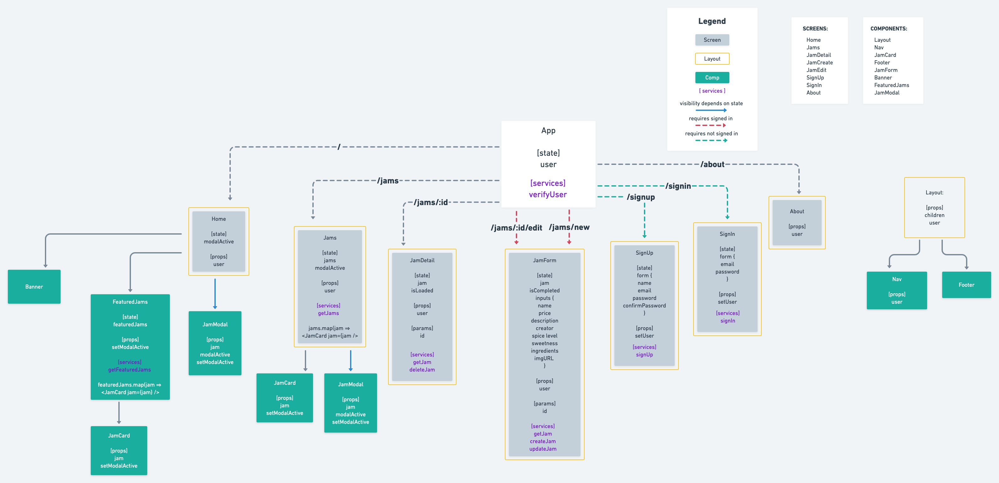

# Project Overview

## GJAM Jam

## Project Description

## Wireframes

## Component Hierarchy

## API and Data Sample

## Schema

### MVP/PostMVP

#### MVP

-

#### PostMVP

-

## Project Schedule

| Day       | Deliverable                           | Status   |
| --------- | ------------------------------------- | -------- |
| Sep 9     | Wireframe                             | Complete |
| Sep 10    | GitHub/Readme/Team Doc/Comp Hierarchy |          |
| Sep 11-12 | Backend                               |          |
| Sep 13    |                                       |          |
| Sep 14    |                                       |
| Sep 15    |                                       |          |
| Sep 16    |                                       |          |
| Sep 17    | Presentation                          |          |

## Timeframes

| Component                  | Priority | Estimated Time | Time Invested | Actual Time |
| -------------------------- | :------: | :------------: | :-----------: | :---------: |
| -------------------------- | :------: | :------------: | :-----------: | :---------: |

## Team google doc?

## SWOT Analysis

### Strengths:

### Weaknesses:

### Opportunities:

### Threats:
