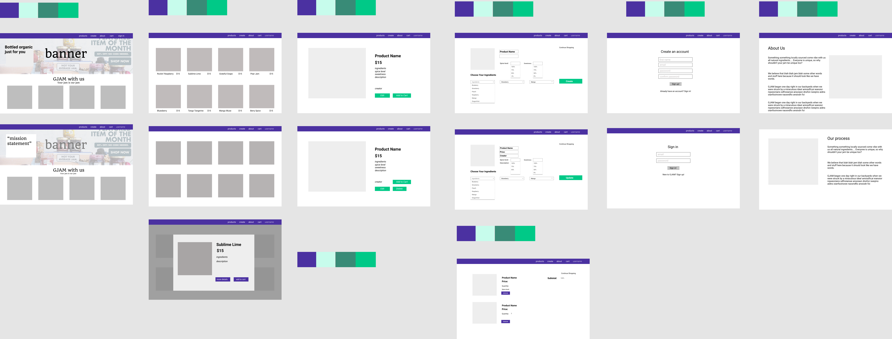

# Project Overview

## GJAM Jam

## Project Description

## Wireframes

## Component Hierarchy

## API and Data Sample

## Schema

### MVP/PostMVP

#### MVP

-

#### PostMVP

-

## Project Schedule

| Day | Deliverable | Status |
| --- | ----------- | ------ |
|     |             |        |
|     |             |        |
|     |             |        |
|     |             |        |
|     |             |
|     |             |        |
|     |             |        |
|     |             |        |

## Timeframes

| Component                  | Priority | Estimated Time | Time Invested | Actual Time |
| -------------------------- | :------: | :------------: | :-----------: | :---------: |
| -------------------------- | :------: | :------------: | :-----------: | :---------: |

## Team google doc?

## SWOT Analysis

### Strengths:

### Weaknesses:

### Opportunities:

### Threats:
